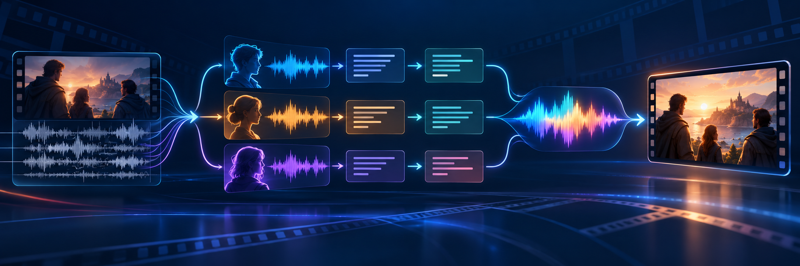

# Автоматический перевод и переозвучивание видео



Годовой проект магистерской программы «Искусственный интеллект», 2026/27
учебный год.

[English version](README.md)

## Идея проекта

Цель проекта — создать программу, которая принимает видео на исходном языке и
возвращает переведённую версию с сохранением таймингов, разделением персонажей и
похожими голосами.

Пользовательский сценарий первого семестра:

1. Пользователь отправляет видео Telegram-боту.
2. Система извлекает и обрабатывает звуковую дорожку.
3. Находит реплики и определяет говорящих.
4. Распознаёт исходный текст и переводит его.
5. Синтезирует перевод голосами персонажей.
6. Подгоняет реплики под исходные интервалы и собирает новое видео.
7. Бот возвращает пользователю готовый файл и краткий отчёт.

## Команда

| Группа | Участники | Зона ответственности | Результат для следующей группы |
|---|---|---|---|
| Анализ оригинала | Неуров Алексей, Гааг Александр | Подготовка аудио, очистка, VAD, сегментация, диаризация, ASR и оценка качества | Реплики с таймингами, голосовыми ID и распознанным исходным текстом |
| Перевод и озвучка | Ковыляев Александр, Панов Никита | Перевод, voice cloning, синтез речи, подгонка длительности и склейка | Переведённое и переозвученное видео |

Куратор: Карагодин Никита.

### Предлагаемое распределение внутри групп

Распределение можно уточнять по мере экспериментов, но на старте фиксируем
следующую ответственность:

- **Алексей:** извлечение и нормализация аудио, enhancement, VAD, интеграция
  первой части конвейера, подготовка данных и воспроизводимость запусков;
- **Александр Г.:** диаризация, ASR, ручная эталонная разметка, расчёт
  WER/CER/VAD/DER/SER и анализ ошибок;
- **Александр К.:** перевод с учётом контекста, терминологии, длины реплики и
  исходного тайминга; TTS и voice cloning совместно с Никитой;
- **Никита:** TTS и voice cloning совместно с Александром К., интонация,
  подгонка длительности, сведение звука и финальная склейка с видео.

Интеграцию FastAPI-сервиса и Telegram-бота выполняет вся команда. У каждой
стадии должен быть ответственный владелец, но формат файлов между группами
согласуется совместно.

## Целевая архитектура

```text
Видео
  ↓
Извлечение английской дорожки
  ↓
Downmix 5.1 → stereo/mono
  ↓
Очистка от музыки и шумов
  ↓
VAD: поиск участков речи
  ↓
Нарезка на реплики
  ↓
Диаризация 16 kHz: speaker_1, speaker_2, ...
  ↓
ASR 16 kHz: исходный текст и тайминги слов
  ↓
Сопоставление speaker_N → голосовой референс
  ↓
Перевод с ограничением по длительности
  ↓
Voice cloning и синтез перевода
  ↓
Подгонка темпа, громкости и длительности
  ↓
Сведение с оригинальной музыкой и эффектами
  ↓
Склейка с видео
```

### Зафиксированные технические решения

1. **Рабочий вход — mono или stereo.** Модели не получают исходные шесть
   каналов 5.1. Если в видео только 5.1, на входе выполняется downmix.
2. **16 kHz mono — рабочий формат для VAD, диаризации и ASR.** Более качественный
   звук 24/48 kHz можно хранить отдельно для enhancement и voice cloning.
3. **Целевая последовательность — очистка перед VAD.** Это должно помочь найти
   тихую речь на фоне музыки. Одновременно сохраняется контрольная ветка
   `downmix → VAD` без очистки: enhancement может удалить шёпот, радио или
   синтетические голоса, поэтому решение принимается по A/B-метрикам.
4. **Текст субтитров — черновой эталон, а не абсолютная истина.** Перед расчётом
   WER/CER выбранный тестовый набор проверяется человеком на слух.
5. **DER нельзя посчитать только по обычным субтитрам.** Нужен ручной RTTM с
   точными интервалами и персонажами. SDH-подписи используются как заготовка.
6. **Исходные видео и дорожки не изменяются.** Все промежуточные результаты
   создаются в отдельных каталогах.

## Формат передачи данных между группами

Первая группа передаёт второй единый манифест реплик:

| Поле | Назначение |
|---|---|
| `episode` | Номер серии/видео |
| `utterance_id` | Уникальный ID реплики |
| `start`, `end`, `duration` | Тайминги в секундах |
| `diarization_speaker` | Технический голосовой ID внутри видео |
| `text` | Распознанный исходный текст |
| `style_hint` | Шёпот, крик, радио, акцент и другие особенности |
| `speech_audio_path` | Путь к очищенному аудио реплики |

Вторая группа дополняет запись:

| Поле | Назначение |
|---|---|
| `translated_text` | Перевод реплики |
| `voice_reference_id` | Референс голоса персонажа |
| `synthesized_audio_path` | Синтезированная реплика |
| `duration_error_ms` | Отличие от исходной длительности |

## Метрики качества

### Анализ оригинала

- **WER** — доля заменённых, удалённых и добавленных слов ASR относительно
  вручную проверенного текста;
- **CER** — та же ошибка на уровне символов;
- **VAD Precision** — какая доля найденных системой интервалов действительно
  содержит речь;
- **VAD Recall** — какую долю реальной речи система не пропустила;
- **VAD F1** — баланс precision и recall;
- **DER** — сумма ложной речи, пропущенной речи и перепутанных говорящих,
  делённая на эталонную длительность речи;
- **SER** — доля времени речи, назначенная неправильному говорящему. В отчёте
  обязательно фиксируется именно это определение SER.

Для честной оценки создаётся фиксированный тестовый набор, который не
используется для подбора параметров. Начальный набор должен включать как простые,
так и сложные серии: чистый диалог, музыку, радио, шёпот, крики и пересекающуюся
речь.

### Перевод

- автоматическая метрика перевода (например, COMET) на проверенной выборке;
- ручная оценка точности смысла и естественности текста;
- доля переводов, помещающихся в исходный тайминг без сильного ускорения;
- абсолютная и относительная ошибка длительности реплики.

### Качество воспроизведения голоса

Качество voice cloning оценивается не одной метрикой, а набором показателей:

- **speaker similarity** — косинусная близость эмбеддинга оригинального и
  синтезированного голоса;
- **MOS 1–5** — ручная оценка естественности и общего качества;
- **similarity MOS 1–5** — насколько синтезированный голос похож на персонажа;
- **ASR WER/CER синтеза** — понятно ли произнесён переведённый текст;
- **MCD** — сравнение оригинала и синтеза по спектрограммам;
- **F0/prosody** — сходство высоты тона, пауз, энергии и эмоционального рисунка;
- **duration error** — отличие от исходного временного окна;
- **clipping и loudness** — отсутствие перегруза и заметных скачков громкости;
- **RTF** — отношение времени обработки к длительности исходного аудио для
  оценки перспектив работы в реальном времени.

Перед сравнением TTS-моделей используется один и тот же набор персонажей,
реплик и текстов. Ручные оценки собираются минимум по нескольким слушателям, а не
по мнению разработчика модели.

## Первый эксперимент

- **Данные:** датасет bazinga.
- **Начальная языковая пара:** английский → русский (En → Ru).
- **Сравнение моделей:** минимум три модели на каждый модельный компонент:
  enhancement, VAD, диаризацию, ASR, перевод и TTS/voice cloning.
- **Объём данных:** размер выборки, общая длительность аудио и разбиение на
  train/validation/test будут определены и зафиксированы на этапе EDA.
- **Оборудование:** конфигурация CPU/GPU, доступная память и программное
  окружение фиксируются в отчёте об эксперименте.

Модели одного компонента сравниваются на одной фиксированной оценочной выборке.
Для каждого запуска сохраняются версии моделей, параметры, метрики качества,
время работы и потребление памяти.

## План по чекпойнтам

Даты ниже взяты из учебного плана. Для чекпойнтов 2–7 они ориентировочные.

### Чекпойнт 1. Старт и планирование — 6 октября, 23:59

**Цель:** зафиксировать тему, команду и реалистичный план на год.

**Работы:**

- согласовать итоговое название и границы проекта;
- создать командный чат и добавить куратора;
- согласовать интерфейс между двумя группами;
- создать GitHub-репозиторий;
- оформить README с темой, командой, куратором, архитектурой, метриками и
  чекпойнтами;

**Результат:** репозиторий, README, распределение ответственности и годовой
план. Каждый участник отправляет ссылку на репозиторий в peer-reviewer и
куратору.

### Чекпойнт 2. Разведочный анализ данных — 27 октября, 23:59

**Цель:** понять особенности аудио и подготовить воспроизводимую выборку.

**Первая группа:**

- собрать статистику по длительности, каналам, sample rate и кодекам;
- изучить громкость, тишину, долю речи, музыку, шумы и пересечения голосов;
- исследовать качество и смещение английских/русских субтитров;
- визуализировать длительности реплик, число персонажей, уверенность ASR и
  проблемные типы сцен;
- определить правила ручной разметки текста, VAD и RTTM;
- создать тестовый набор для WER, CER, VAD, DER и SER.

**Вторая группа:**

- оценить длину русского и английского текста;
- исследовать отношение длительности перевода к исходному таймингу;
- собрать голосовые референсы и проверить их качество;
- определить типы эмоций и стилей речи, важные для TTS.

**Артефакты:** EDA-ноутбук/отчёт, таблицы и графики, спецификация датасета,
annotation guide, фиксированный test split.

### Чекпойнт 3. Первые ML-модели — 27 ноября, 23:59

**Цель:** получить измеримый baseline из готовых моделей.

**Первая группа:**

- сравнить минимум три готовые модели enhancement;
- сравнить минимум три модели VAD;
- сравнить минимум три ASR-модели по WER/CER;
- сравнить минимум три модели диаризации, включая Nemotron, по DER/SER;
- провести A/B-тест `очистка → VAD` против `VAD без очистки`;
- сохранить конфигурации, время работы и потребление памяти.

**Вторая группа:**

- сравнить минимум три модели перевода и выбрать baseline;
- сравнить минимум три готовые TTS/voice-cloning модели;
- реализовать подгонку текста и аудио под тайминг;
- измерить speaker similarity, MOS, ASR WER синтеза и duration error.

**Результат:** первая end-to-end обработка нескольких видео, таблица метрик,
ошибки baseline и обоснованный выбор моделей.

### Чекпойнт 4. ML-сервис — 15 декабря, 23:59

**Цель:** завернуть baseline в сервис и Telegram-бота.

**FastAPI:**

- загрузка видео и выбор языка;
- создание задачи и получение `job_id`;
- проверка статуса;
- скачивание результата и отчёта;
- обработка ошибок, ограничений размера и неподдерживаемых форматов.

**Telegram-бот:**

- принимает видео или ссылку на файл;
- предлагает исходный и целевой язык;
- показывает этапы и прогресс обработки;
- возвращает переозвученное видео;
- сообщает, если отдельные реплики требуют ручной проверки.

**Инженерные требования:** очередь задач, временное хранилище, логирование,
конфигурация через `.env`, Docker и минимальные автоматические тесты.

**Результат первого семестра:** рабочий прототип на готовых моделях и скриптах,
демонстрирующий полный путь от видео до переведённого видео.

### Промежуточная защита — 10–15 января

- показать демонстрацию Telegram-бота;
- представить архитектуру и вклад каждого участника;
- показать baseline-метрики каждого этапа;
- разобрать удачные и неудачные примеры;
- зафиксировать план дообучения и перехода от Telegram-бота к сервису на сайте
  во втором семестре.

### Чекпойнт 5. Улучшение ML-модели — 15 марта, 23:59

**Цель:** улучшить baseline за счёт данных, параметров и более сильных моделей.

- расширить и очистить ручную разметку;
- проанализировать ошибки VAD, ASR, диаризации, перевода и TTS;
- подобрать пороги и параметры на validation split;
- улучшить разделение музыки и речи;
- улучшить глобальное объединение голосовых кластеров;
- повысить устойчивость к шёпоту, радио, крикам и фоновой музыке;
- подготовить данные для дообучения моделей интонации/voice cloning;
- сравнить результат с baseline по заранее зафиксированным метрикам.

### Чекпойнт 6. Нейронные сети — 5 мая, 23:59

**Цель:** дообучить хотя бы один ключевой компонент и доказать улучшение.

Приоритет второго семестра — интонация и качество синтеза, но выбор финального
компонента принимается по ошибкам baseline.

Возможные эксперименты:

- дообучение TTS/voice-cloning модели на голосах и стилях персонажей;
- управление эмоцией, F0, энергией и длительностью;
- дообучение ASR или адаптация к шумным/искажённым голосам;
- адаптация speaker embeddings/диаризации;
- обучение или fine-tuning модели enhancement.

Для каждого эксперимента фиксируются данные, архитектура, гиперпараметры,
baseline, итоговые метрики и примеры ошибок.

### Чекпойнт 7. Финальные доработки

**Цель:** сделать эксперименты воспроизводимыми и подготовить стабильную
демонстрацию.

- подключить MLflow;
- логировать параметры, метрики, версии моделей и артефакты;
- переобучить лучшую конфигурацию на зафиксированных данных;
- проверить воспроизводимость с чистого окружения;
- провести нагрузочные и устойчивостные тесты;
- измерить время, память и максимальную длину видео;
- подготовить финальные графики, таблицы и ablation study;
- реализовать сайт для загрузки видео, выбора языка, просмотра статуса и
  скачивания результата на базе существующего FastAPI-сервиса;
- оформить документацию API, сайта и локального запуска;
- зафиксировать ограничения и направления развития.

### Итоговая защита — 13–20 июня

На защите демонстрируются:

- стабильный сервис на сайте и полный end-to-end сценарий;
- сравнение baseline и улучшенной системы;
- WER, CER, VAD Precision/Recall/F1, DER, SER;
- метрики перевода и качества синтеза;
- вклад каждого участника;
- анализ ошибок, ограничений и устойчивости.

## План по семестрам

### Первый семестр: готовые модели и рабочая программа

- готовые модели enhancement, VAD, ASR и диаризации;
- готовая модель перевода;
- готовые модели voice cloning/TTS;
- FastAPI-сервис;
- Telegram-бот;
- полный end-to-end baseline;
- фиксированный тестовый набор и начальные метрики.

### Второй семестр: данные, дообучение, качество и сервис на сайте

- расширение ручной разметки;
- улучшение WER/CER/DER/SER;
- дообучение выбранных моделей;
- улучшение интонации и похожести голосов;
- уменьшение ошибки длительности;
- MLflow, воспроизводимость и анализ устойчивости;
- переход от Telegram-бота к сервису с интерфейсом на сайте;
- финальная оптимизация сервиса.


## Definition of Done

Точные критерии завершения, включая допустимую ошибку тайминга и целевое
улучшение качества, будут определены после создания и оценки рабочего baseline.
Они будут зафиксированы до оценки улучшенной системы.

Предварительные критерии завершения:

1. Сервис принимает видео через сайт и возвращает переозвученный результат.
2. Все стадии воспроизводимо запускаются из чистого окружения.
3. На фиксированном test split рассчитаны метрики каждого этапа.
4. Улучшенная система сравнивается с baseline первого семестра.
5. Реплики сохраняют персонажа, смысл и допустимое отклонение по таймингу.
6. Эксперименты и артефакты зарегистрированы в MLflow.
7. Известные ограничения описаны и подтверждены примерами.
